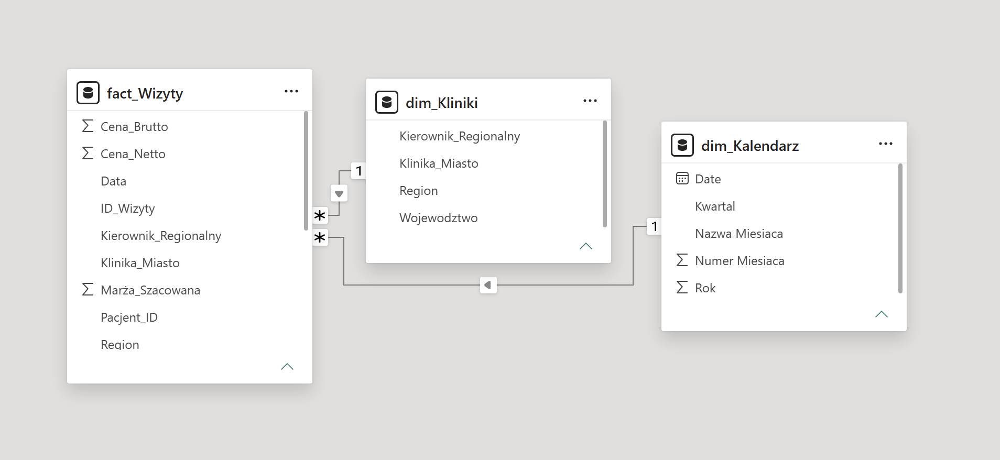
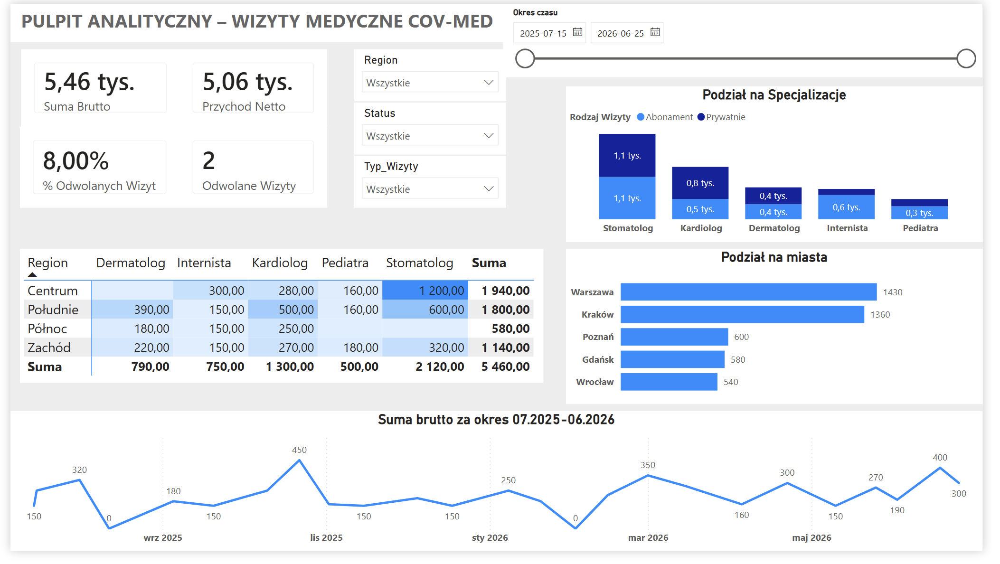
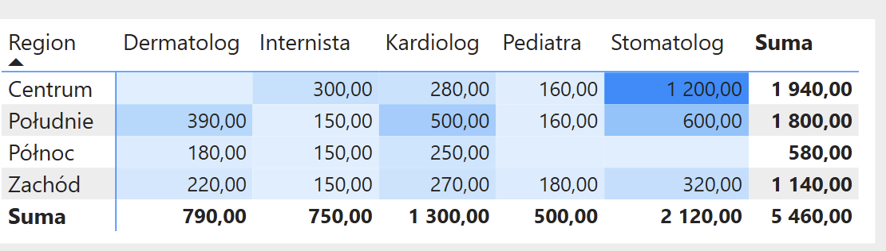

# 🏥 Healthcare Operations & Revenue Dashboard (Power BI)

An end-to-end Business Intelligence solution built in **Power BI**, analyzing medical clinic operations, revenue streams, patient demographics, and appointment cancellation metrics across multiple clinic locations.

---

## 📌 Project Overview
The goal of this project was to provide executive leadership and regional managers with full visibility into financial and operational performance. The dashboard bridges raw transactional data with actionable insights regarding revenue drivers and capacity loss due to appointment cancellations.

### 🔑 Key Business Questions Answered:
* What is the total gross and net revenue across different regions and specialties?
* How are cancellations distributing over time and across specific branches?
* Which specialties generate the highest revenue per appointment (Average Order Value)?
* What is the monthly breakdown of appointment traffic vs. revenue?

---

## 📐 Data Architecture & Modeling

The project leverages a **Star Schema** architecture to ensure optimal reporting performance and scalability:

* **`fact_Wizyty`** – Transactional table containing appointment details, pricing, status, and clinic IDs.
* **`dim_Kliniki`** – Dimension table with geographic metadata, regional managers, and clinic info.
* **`dim_Kalendarz`** – Custom DAX Date dimension enabling time-intelligence calculations.



---

## 📊 Dashboard Preview

| Executive Overview | Matrix View |
| :---: | :---: |
|  |  |

---

## 🧠 Key DAX Measures & Logic

Here are sample DAX measures implemented in the model to handle financial aggregations and operational filtering:

### 1. Total Gross Revenue
```dax
Suma Brutto = 
SUM(fact_Wizyty[Cena_Brutto])
```

2. Isolated Cancellation Count
Calculates the exact number of cancelled visits using context transition via CALCULATE:
```dax
Liczba Odwolanych Wizyt = 
CALCULATE(
    COUNTROWS(fact_Wizyty), 
    fact_Wizyty[Status] = "Odwołana")
```

3. Cancellation Rate (%)
Safe division calculation preventing divide-by-zero errors:
```dax
% Odwolanych Wizyt = 
DIVIDE(
    [Liczba Odwolanych Wizyt], 
    COUNTROWS(fact_Wizyty), 
    0)
```

## 🛠️ Tech Stack & Methodology

* **ETL & Data Transformation:** Power Query (M Language) – handled regional decimal formatting, header promotion, custom net/margin calculations, and table merges.
* **Data Modeling:** Power BI Desktop (`Star Schema`, Relationship Cardinality `1:*`, Single-direction filtering).
* **Calculations:** DAX (Time Intelligence, Explicit Measures, Context Modification via `CALCULATE`).
* **Visualization:** Conditional Formatting (Heatmaps), Interactive Slicers, Custom KPI Cards, and Dynamic Line Charts.
* **Source Data:** Google Sheets / CSV.

## 🚀 How to Run
1. Download the `.pbix` file from this repository.
2. Open it using **Power BI Desktop**.
3. Explore the interactive visual elements and slicers.
